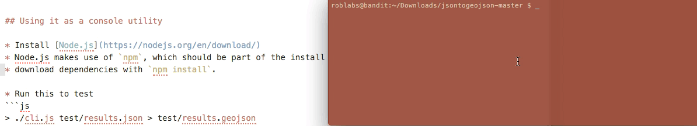

# JSON to GeoJson.

This converts a certain forms of JSON
to
[GeoJSON](http://www.geojson.org/), with [nodejs](http://nodejs.org/).

* the original data structure is preserved as the properties in GeoJson.


## Using it as a console utility

* Install [Node.js](https://nodejs.org/en/download/)
* Node.js makes use of `npm`, which should be part of the install
* download dependencies with `npm install -g`.


* Run this to test
```js
> ./cli.js test/results.json > test/results.geojson
```

-----



-----

### JSON is meta data.json
* generated from [Maptiler](http://www.maptiler.com) or [gdal2tiles](https://github.com/roblabs/gdal2tilesp)

This JSON is converted to [Geojson](./test/metadata.geojson)

```js
{
	"name": "324511630_Descanso",
	"description": "Descanso Ranger Station, 7.5 minute quadrangle of 32 45', -116 30'",
	"version": "1.0.0",
	"attribution": "",
	"type": "overlay",
	"format": "png",
	"minzoom": "11",
	"maxzoom": "15",
	"bounds": "-116.625,32.7499998291,-116.500000129,32.8749999991",
	"scale": "1",
	"profile": "mercator"
}

```

-----

-----
### JSON is a results array

```js
{ "results": [
        {
        "data": 17,
        "data1": "2006-04-23T19:32:42.469Z",
        "data2": 2.253802555866411,
        "latitude": 1.2,
        "longitude": 2.3,
        "data3": 16.2,
        "data4": "some-data",
        "data5": "2004-04-23T19:32:42.469Z",
        "data6": 20
    }
  ]
}

```

Which generates the following GeoJSON
```js
{
  "type": "FeatureCollection",
  "features": [
    {
      "type": "Feature",
      "properties": {
        "data": 17,
        "data1": "2006-04-23T19:32:42.469Z",
        "data2": 2.253802555866411,
        "latitude": 1.2,
        "longitude": 2.3,
        "data3": 16.2,
        "data4": "some-data",
        "data5": "2004-04-23T19:32:42.469Z",
        "data6": 20
      },
      "geometry": {
        "type": "Point",
        "coordinates": [
          2.3,
          1.2
        ]
      }
    }
  ]
}
```
